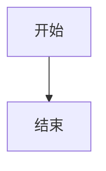

# Markdown + Mermaid 查看器使用说明

## 📖 快速开始

### 方式 1：打开 MD 文件
1. 双击打开 `START_HERE.html`
2. 点击"📄 MD 文件查看器"按钮
3. 点击"📂 打开 MD 文件"按钮
4. 选择你的 `.md` 或 `.markdown` 文件

### 方式 2：直接访问
直接打开 `md-viewer.html` 文件

## ✨ 主要功能

### 1. Markdown 渲染
- ✅ 支持标题、段落、列表
- ✅ 支持代码块（语法高亮）
- ✅ 支持表格、引用
- ✅ 支持链接、图片

### 2. Mermaid 图表渲染
自动识别并渲染以下 Mermaid 图表：
- 📊 流程图 (graph)
- 📅 时序图 (sequenceDiagram)
- 🗂️ 类图 (classDiagram)
- 🔄 状态图 (stateDiagram)
- 📋 甘特图 (gantt)
- 🎯 思维导图 (mindmap)

### 3. 图表操作功能

每个 Mermaid 图表都支持以下操作：

#### 📝 查看代码
- 点击"📝 查看代码"按钮
- 显示/隐藏 Mermaid 源代码
- 方便查看和学习

#### 🔍 缩放功能
- **🔍 放大**：每次放大 25%
- **🔎 缩小**：每次缩小 25%
- **⏺️ 重置**：恢复到 100%
- **滑块调节**：25% - 300% 无级调节

#### ⛶ 全屏模式
- 点击"⛶ 全屏"进入全屏
- 按 ESC 键或点击"✕"退出全屏
- 全屏查看图表细节

#### 📤 导出功能
- **📤 SVG**：导出矢量图格式
- **🖼️ PNG**：导出位图格式
- **📤 导出所有图表**：批量导出所有图表

### 4. 目录导航
- 自动生成文档目录
- 点击目录项快速跳转
- 支持 h1、h2、h3 三级标题

## 📋 使用示例

### 示例 1：打开 BI 架构图表.md

1. 打开 `md-viewer.html`
2. 点击"📂 打开 MD 文件"
3. 选择 `MI 架构图表.md`
4. 查看渲染效果

### 示例 2：加载演示文档

1. 打开 `md-viewer.html`
2. 点击"📋 加载示例"
3. 查看内置的示例文档

## 🎯 功能详解

### 查看代码
```
点击"📝 查看代码" → 显示 Mermaid 源代码 → 再次点击隐藏
```

### 缩放操作
```
方法 1：点击 🔍 放大 / 🔎 缩小 按钮
方法 2：拖动滑块精确调节
方法 3：点击 ⏺️ 重置 恢复 100%
```

### 全屏模式
```
进入全屏：点击 ⛶ 全屏
退出全屏：按 ESC 键 或 点击 ✕ 按钮
```

### 导出图片
```
单个导出：
  - 点击 📤 SVG 导出矢量图
  - 点击 🖼️ PNG 导出位图

批量导出：
  - 点击顶部工具栏的 📤 导出所有图表
  - 自动依次下载所有图表
```

## 💡 使用技巧

### 1. 文件命名
- 使用清晰的 MD 文件名
- Mermaid 代码块使用 ```mermaid 标记

### 2. 图表优化
- 保持 Mermaid 代码简洁
- 使用 classDef 定义样式
- 添加注释说明图表内容

### 3. 批量处理
- 使用"导出所有图表"功能
- 自动按顺序下载所有图表
- 文件名为 mermaid-1.png, mermaid-2.png...

### 4. 目录导航
- 使用规范的标题层级
- h1 主标题 → h2 章节 → h3 小节
- 自动生成可点击的目录

## ⚠️ 注意事项

### 1. 网络依赖
- 首次使用需要网络连接（加载 marked 和 mermaid 库）
- 后续使用可完全离线

### 2. 完全离线方案
下载以下文件到本地：
```
md-viewer.html 同级目录：
├── md-viewer.html
├── js/
│   └── marked.min.js
└── js/
    └── mermaid.min.js
```

修改 HTML 中的引用：
```html
<!-- 从 -->
<script src="js/marked.min.js"></script>
<!-- 改为 -->
<script src="js/marked.min.js"></script>
```

### 3. 浏览器兼容
- 推荐：Chrome、Edge、Firefox
- 需要支持现代 JavaScript
- 不支持 IE 浏览器

### 4. 文件大小
- 支持大型 MD 文件
- 建议单个文件不超过 10MB
- 过多图表可能影响性能

## 🆘 故障排除

### 问题 1：文件打不开
**解决**：
- 检查文件扩展名是否为 .md 或 .markdown
- 确保文件编码为 UTF-8
- 尝试其他浏览器

### 问题 2：Mermaid 图表不显示
**解决**：
- 检查代码块标记是否为 ```mermaid
- 验证 Mermaid 语法是否正确
- 查看浏览器控制台错误信息

### 问题 3：无法导出图片
**解决**：
- 确保图表已完全渲染
- 检查浏览器是否允许下载
- 尝试其他浏览器

### 问题 4：目录为空
**解决**：
- 确保 MD 文件包含标题（# ## ###）
- 检查标题格式是否正确
- 重新加载文件

## 📚 Markdown 语法参考

### 标题
```markdown
# 一级标题
## 二级标题
### 三级标题
```

### Mermaid 代码块
````markdown

````

### 列表
```markdown
- 项目 1
- 项目 2
- 项目 3
```

### 表格
```markdown
| 列 1 | 列 2 | 列 3 |
|------|------|------|
| 值 1  | 值 2  | 值 3  |
```

## 🔗 相关资源

- [Markdown 语法教程](https://markdown.com.cn/)
- [Mermaid 官方文档](https://mermaid.js.org/)
- [Mermaid 中文教程](https://mermaid.nodeee.cn/)

## 📞 技术支持

如有问题，请查看：
1. 浏览器控制台错误信息
2. Mermaid 官方文档
3. Markdown 语法教程

---

**最后更新**: 2024 年  
**版本**: 1.0
