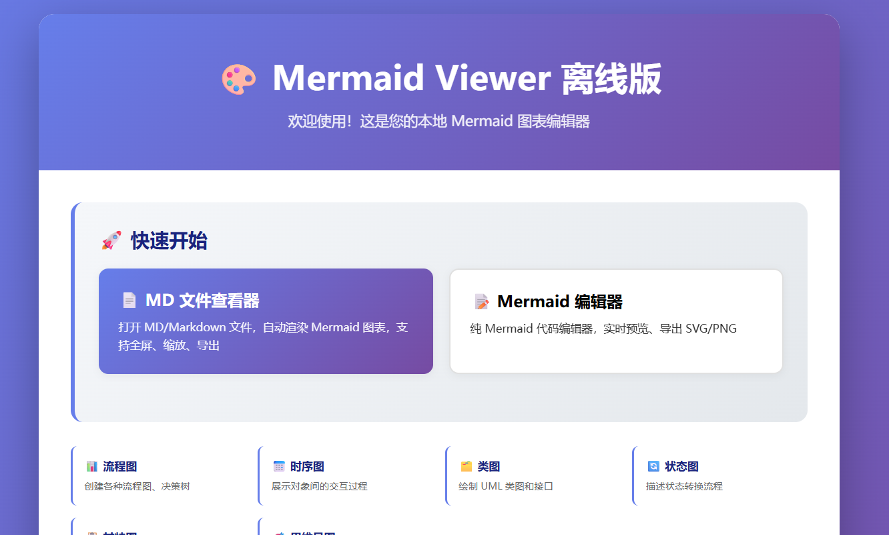
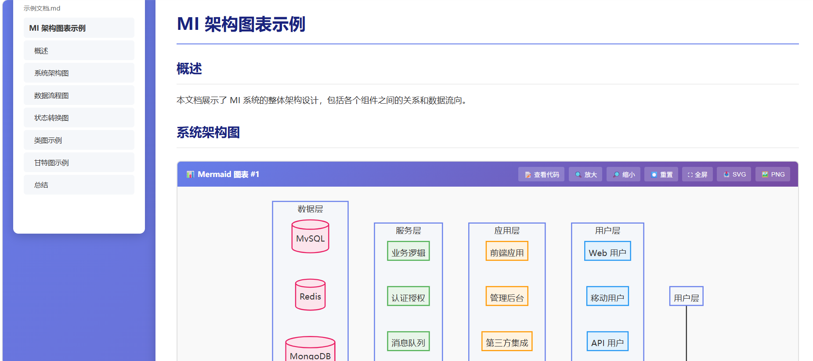

# Mermaid Viewer 离线版使用指南

## 📁 文件夹结构

```
mermaid-viewer-offline/
├── index.html          # 主页面（推荐使用）
├── README.md           # 使用说明
├── css/                # 样式文件（已下载）
├── js/                 # JavaScript 文件（已下载）
└── html/               # 其他 HTML 页面（已下载）
```

## 🚀 快速开始

### 方式 1：使用简化的离线编辑器（推荐）

1. **直接打开** `/START_HERE.html` 文件可以点击md和mermaid混合查看模式和mermaid模式
两种模式
md-viewer.html是md和mermaid混合查看模式，给了一个样例文件MD 《查看器使用说明.md》
index.html是只进行mermaid离线查看模式





## 📝 功能说明

### 支持的图表类型

1. **流程图 (Flowchart)**
   ```mermaid
   graph TD
       A[开始] --> B{判断}
       B -->|是 | C[操作 1]
       B -->|否 | D[操作 2]
   ```

2. **时序图 (Sequence Diagram)**
   ```mermaid
   sequenceDiagram
       Alice->>John: 你好 John，最近怎么样？
       John-->>Alice: 很好！
   ```

3. **类图 (Class Diagram)**
   ```mermaid
   classDiagram
       Animal <|-- Duck
       Animal <|-- Fish
       Animal: +int age
       Animal: +String gender
   ```

4. **状态图 (State Diagram)**
   ```mermaid
   stateDiagram-v2
       [*] --> Still
       Still --> [*]
       Still --> Moving
       Moving --> Still
   ```

5. **甘特图 (Gantt Chart)**
   ```mermaid
   gantt
       title 项目计划
       dateFormat  YYYY-MM-DD
       section 阶段 1
       任务 1 :2024-01-01, 30d
   ```

6. **思维导图 (Mindmap)**
   ```mermaid
   mindmap
       root((主题))
           分支 1
               子分支 1
               子分支 2
   ```


## 💡 使用技巧

1. **实时预览**：在编辑器中输入 Mermaid 代码，1 秒后自动渲染
2. **加载示例**：点击"加载示例"按钮查看示例代码
3. **导出图片**：支持导出 SVG 和 PNG 格式
4. **语法高亮**：建议使用支持 Mermaid 语法的编辑器（如 VS Code）

## ⚠️ 注意事项

1. **网络依赖**：简化版 index.html 默认从 CDN 加载 Mermaid 库
2. **浏览器兼容**：推荐使用 Chrome、Edge、Firefox 等现代浏览器
3. **文件下载**：如果某些资源加载失败，请检查浏览器控制台
4. **版本更新**：下载的是特定版本的资源，可能不是最新版

## 📚 学习资源

- [Mermaid 官方文档](https://mermaid.js.org/)
- [Mermaid 中文教程](https://mermaid.nodeee.cn/)
- [Mermaid Live Editor](https://mermaid.live/)

## 🆘 故障排除

### 问题 1：打开页面显示空白
**解决**：检查浏览器控制台是否有错误，确保 JavaScript 已启用

### 问题 2：图表无法渲染
**解决**：
1. 检查 Mermaid 代码语法是否正确
2. 确认 Mermaid 库已正确加载
3. 查看浏览器控制台的错误信息

### 问题 3：导出功能不可用
**解决**：确保图表已成功渲染，并且浏览器支持 Blob 和 URL 对象

## 📞 技术支持

如有问题，请参考：
- Mermaid GitHub: https://github.com/mermaid-js/mermaid
- 原网站：https://mermaid-viewer.com/zh

---

**最后更新**: 2024 年
**版本**: 1.0
